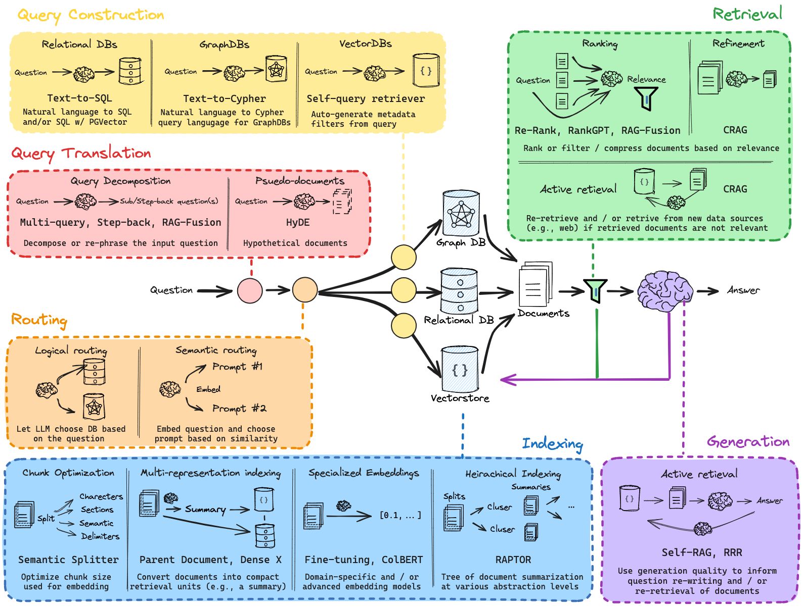

### Todos

 https://www.youtube.com/watch?v=sVcwVQRHIc8

1. Lang Smith
2. MultiQuery
3. RAG Fusion
4. Finding a better use case
5. make pinecone retriever as langchain retriever
6. Decomposition 
7. Step back appraoch
8. Hyde

// data from folllowing 
Reading apartments_rent_pl_2024_06.csv ...
Reading apartments_rent_pl_2024_04.csv ...
Reading apartments_rent_pl_2024_05.csv ...
Reading apartments_rent_pl_2024_01.csv ...
Reading apartments_pl_2023_12.csv ...
Reading apartments_rent_pl_2024_02.csv ...
Reading apartments_pl_2023_11.csv ...
Reading apartments_pl_2023_10.csv ...
Reading apartments_rent_pl_2024_03.csv ...
Reading apartments_pl_2023_09.csv ...
Reading apartments_pl_2024_01.csv ...
Reading apartments_pl_2023_08.csv ...
Reading apartments_rent_pl_2023_12.csv ...
Reading apartments_pl_2024_03.csv ...